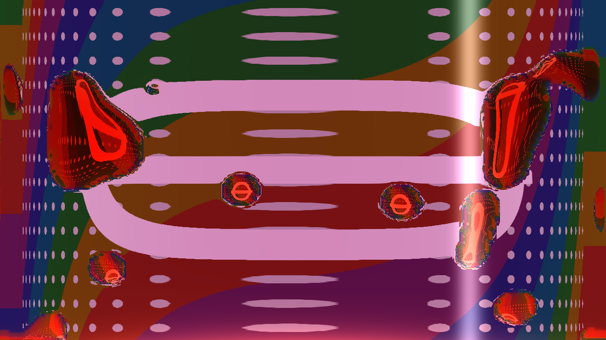
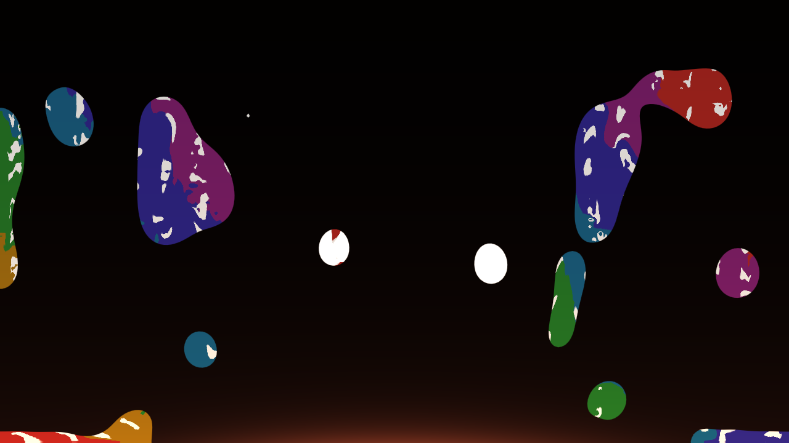
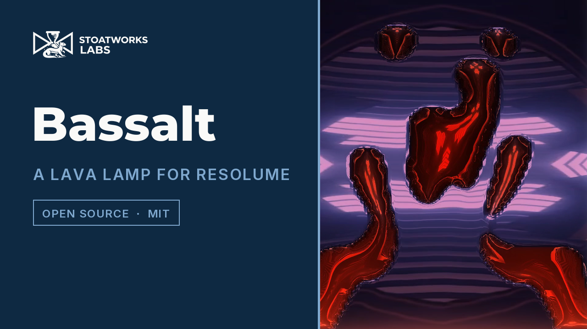

# bassalt

> **AI-assisted project.** This codebase was created with [Claude](https://claude.com/claude-code)
> (Anthropic), directed and reviewed by a human author. It has **never been
> loaded into Resolume**. Everything below is measured by an offline harness
> that drives the real plugin class in a headless GL context. `bstest --darcy`
> checks the GPU's flow solve against an exact CPU solve of the same equations
> (they agree to 1e-9), and the flow itself against the Hele-Shaw speed of a
> blob, extrapolated over three resolutions (0.1-0.5%). `--still` requires a
> level lamp at rest to stay exactly at rest, `--crossover` finds the
> temperature a blob stops at to 4e-6 K of where the density laws put it, and
> `--volume` requires the wax to be conserved to the rounding of its own sums.
> `bstest --negative` re-runs every check against a deliberately wrong model
> and fails if any of them *passes*, and `--mutate` changes one character of
> the shipped shaders and fails if nothing notices (see [Status](#status)). A
> control sweep fails if any parameter turns out to do nothing.

A lava lamp for Resolume Arena/Avenue, as an FFGL effect. Put a clip through
it and it becomes the world behind the lamp, bent by the wax, or the wax
itself, carried up and down.

The name is the lamp's two real controls. **Bass** drives the bulb. **Salt** is
what a lamp maker dissolves in the water to set its density against the wax.

Clip = Behind, Glass = Cylinder, eight minutes of lamp. The cylinder
magnifies the world across its middle and squeezes it at the sides; each blob
is a lens with a small upside-down ring in it. The picture is the harness's
own card. Rendered by the plugin's offline harness (`bstest`), not captured
from Resolume.

<!-- downloads:start -->

## Download

**[v0.1.0](https://github.com/stoatworks-labs/bassalt/releases/tag/v0.1.0)** — prebuilt for macOS and Windows. Pick your platform:

<b>macOS</b> — Universal (Apple Silicon + Intel)

| Build | Download | Size |
| --- | --- | --- |
| Universal (Apple Silicon + Intel) · .dmg disk image | [`bassalt-0.1.0-macos-universal.dmg`](https://github.com/stoatworks-labs/bassalt/releases/download/v0.1.0/bassalt-0.1.0-macos-universal.dmg) | 262 KB |
| Universal (Apple Silicon + Intel) · .zip archive | [`bassalt-macos-universal.zip`](https://github.com/stoatworks-labs/bassalt/releases/latest/download/bassalt-macos-universal.zip) | 220 KB |

<b>Windows</b> — x64

| Build | Download | Size |
| --- | --- | --- |
| x64 · .exe installer | [`bassalt-0.1.0-windows-x86_64-setup.exe`](https://github.com/stoatworks-labs/bassalt/releases/download/v0.1.0/bassalt-0.1.0-windows-x86_64-setup.exe) | 234 KB |
| x64 · .zip archive | [`bassalt-windows-x86_64.zip`](https://github.com/stoatworks-labs/bassalt/releases/latest/download/bassalt-windows-x86_64.zip) | 129 KB |

All builds, checksums and release notes: [github.com/stoatworks-labs/bassalt/releases](https://github.com/stoatworks-labs/bassalt/releases).

macOS builds are signed and notarised and open normally. The Windows builds are unsigned, so SmartScreen warns once.

<!-- downloads:end -->

## The one idea

**The frame is a lava lamp, and the lamp is a heat engine.** A bulb in the base
heats wax that is a little denser than the water above it when cold. Wax
expands with heat about three times faster than water, so above a crossover
temperature T* it is the lighter, and it rises; at the cap it cools, is denser
again, and sinks.

Nothing is animated. The wax, the heat and the flow are four fields on a grid
sized in metres, with their constants in the open:

- the wax is a **Cahn-Hilliard** phase field, whose interface carries surface
  tension;
- the heat is **advected and conducted**, fed by the bulb through the base and
  lost through the glass and harder through the metal cap;
- the flow is **Darcy's law in a Hele-Shaw cell**, the thin flat lamp the frame
  literally is, driven by the density and the surface tension and solved every
  step by multigrid.

What falls out of that, rather than being arranged:

- **Pillars that neck and pinch off.** A hot layer of wax under cold water is
  Rayleigh-Taylor unstable. In a Hele-Shaw cell, waves longer than
  2 pi sqrt( sigma / drho g ) grow and shorter ones die, so the wax leaves the
  base as fingers of one size.
- **The warm-up.** A cold lamp is a slab of solid wax; it has to melt from the
  coil up, and at 1x that takes an hour, as a real one does. Speed runs to
  300x, and Warm jumps straight to the hot lamp.
- **The stalls.** Too much bulb and every drop of wax is above T*: it all
  pools at the cap. Too little and it never leaves the base. Salt moves T*
  11.3 K per per cent.
- **The lenses.** Wax (n = 1.44) in water (1.34) is a lens. A round blob bends
  the world behind it into a small upside-down picture, tinted by the wax.

Clip = Dyed: the clip is the wax, carried by the flow, so the picture is
stretched, pinched and carried up and down. Rendered by `bstest`.

A ten-second reel, `docs/demo.mp4`: the warm lamp, then Pour, and the card's
bright ring becomes wax, rises, necks and breaks up.

### The one invented step

The lamp is a 2-D slice, so its blobs have no thickness to be a lens with.
Each blob is inflated into one: its thickness is 4 sqrt( h ), with
-lap h = 1 inside the wax and h = 0 at its edge, which makes a round blob
exactly a sphere's chord, 2 sqrt( R^2 - r^2 ). `bstest --lens` checks that.
Everything else is the physics.

*[Watch it](https://www.youtube.com/watch?v=TUJutkxg1KY) — 51 seconds: a hot
layer of wax leaving the base as pillars that neck and pinch off, every blob a
lens over the world behind it, Dyed turning the clip into the wax, Pour turning
a bright ball into wax that rises and breaks up, Salt floating all of it to the
cap, and the velocity field underneath. Every frame is the real plugin's
output: an FFGL plugin has no window, so the footage is rendered by this
repository's own offline harness (`bstest --pipe`, driven by a cue sheet)
rather than filmed off a screen, and the clips are Resolume's bundled demo
media. The whole take is one run of one lamp, never reset.*

## Controls

- **Lamp:** Lamp Height (the frame's height, 0.1 to 1 m) and Gap (the lamp's
  depth, 1 to 20 mm: the flow goes as its square). Detail (64 to 256 cells up
  the lamp). Speed (1x to 300x). Ambient (10 to 40 C). **Warm** jumps to the hot
  lamp; **Reset** is the cold slab.
- **Bulb:** Bulb (0 to 60 W), Bulb Lag (its thermal time constant, 0.5 to 120 s
  of lamp), Coil (the conductivity the coil adds at the base).
- **Fluids:** Salt (0 to 4%), Wax Amount (5 to 40% of the lamp, read on Reset),
  Surface Tension (0 to 10 mN/m), Wax Viscosity (the melt's, 1 mPa s to 1 Pa s),
  Melting Point (35 to 70 C; below it wax stiffens e-fold every 2.5 K).
- **Audio:** Audio (Resolume's FFT buffer). Bass adds up to 60 W to the bulb at
  full level, through the bulb's own lag, so a heavy bass section warms the
  lamp and a breakdown lets it settle. Bass Band is how many of the lowest bins
  count as bass. Kick puts up to 300 J into the base on each onset.
- **Clip:** Clip (*Behind* or *Dyed*). **Pour** turns the clip's bright parts,
  above Pour Threshold, into wax. Clip Heat lets the clip's brightness heat the
  lamp (up to 60 W at all white): bright regions melt.
- **Look:** Wax Colour (what 3 cm of wax lets through), Liquid Tint (what the
  lamp's middle lets through), Glow (the bulb's light, the wax scattering it,
  and the glass's highlight), Glass (*Flat* panel or *Cylinder*), Refraction
  (how far behind the lamp the world is, 0 to 1 m).
- **Output:** View shows *Lamp*, the effect. *Temperature*, *Wax*, *Velocity*
  and *Density* show one field of the model on its own. Mix.

## Status

**v0.1.0, released 2026-09-23, and honestly early.**

It has **never been loaded into Resolume** on either platform. Everything here
comes from the offline harness, which drives the real plugin class headlessly.
`oxbow probe` on the *downloaded, notarised* release bundle reads it the way a
host does and finds `SW Bassalt` / `BS01` / effect, 38 parameters; nothing
else has run it. It has only been measured on macOS (Apple Silicon). The
Windows x64 DLL is built by MSVC in CI (it compiled first time) and nothing
has run it. There is no OpenFX port, no browser demo and no factory presets.
The macOS downloads are signed and notarised (`spctl`: Notarized Developer
ID); the Windows ones are unsigned.

What is measured, on this machine:

| | |
| --- | --- |
| a lamp at rest | a cold level slab: the flow is **exactly 0** for 3 lamp-minutes, every row identical to the bit |
| spurious currents | a round blob of neutral density: **1.5e-5 m/s** at most (the capillary scale is 8.3e-4), falling **107x** over 20 minutes |
| wax conserved | 7.4 lamp-minutes of convection: drift **6e-7** of the wax (bound 1.2e-5) |
| no new extrema | every cell, every step, inside its stencil's old range: **0** of 287,000 |
| the crossover | a blob stops at T* to **4e-6 K** at three salts; T* moves **-11.293 K** per 1% salt, as the laws say |
| the flow solve | GPU against an exact CPU solve of the same system: **1e-9** relative, inside the residual's own bound |
| the Hele-Shaw speed | a blob at four viscosity ratios, extrapolated to a sharp interface: **0.08-0.45%** from U = K_in K_out drho g / ( K_in + K_out ) |
| multigrid | **0.13** a cycle (textbook two-grid 0.074), **0.13** across a 10^5 jump, **0.25** in a running lamp; one cycle a step leaves **7e-4** of the flow |
| diffusion | a hot spot's variance against the scheme's own law: **1e-8 m^2** in 2.3e-4 |
| Rayleigh-Taylor | four modes grow or decay as they should, the rates within **0.8-2.4%** of the law once the diffuse interface's own response is divided out; cutoff **0.7%** from sqrt( drho g / sigma ) |
| heat | the lamp's mean follows the lumped law to **0.6** of Euler's bound; every step's joules add up, to **4e-3** of its 2-ulp bound |
| the bulb | **63.2121%** at its time constant; a primed onset detector fires on frame 1 |
| the glass | Flat is the identity to **3e-8**; Cylinder is Snell's law to **1e-5**, at two rasters |
| the lens | a round blob is a sphere's chord to **2.6-3.7%** at the centre (the interface's width) |
| GL state | everything a host could care about, pack buffer included, as it went in |
| negative controls | **14** deliberately wrong models, **all 14** detected; one character of shipped GLSL changed, **caught** |
| dead controls | **30** parameters, all live |

Render cost (`bstest --bench`, the warm lamp at the default 3x, best of five
batches, on a machine shared with other jobs): **1.8-2.7 ms/frame at 720p,
2.0-2.7 at 1080p, 2.2-3.0 at 4K**. Detail sets the grid, not the raster, so 4K
costs little more than 720p; Detail 64 is 1.5 ms. The cost is in the steps: at
30x it is 8-11 ms, and Detail 256 is 14 ms at 3x.

What is **not** verified, and is the honest limit of this release:

- **A flat lamp, not a round one.** The flow is Darcy's law in a thin gap. A
  real round lamp's flow is neither that nor creeping flow, and nothing here is
  compared with one.
- **Short waves are slow.** The wax's interface is four cells wide, and at the
  default Detail it passes only 56-85% of a sharp interface's growth for
  wavelengths of 4 to 18 cm. `--rt` measures how much.
- **Surface tension stops at 10 mN/m.** A lamp's wax, with its surfactants, is
  a few; clean paraffin on clean water is 50, and at that the explicit flow step
  would need a hundred substeps a frame.
- **Speed 300x is really about 70x** once the lamp convects: the step is limited
  by the capillary time and there are at most 32 a frame.
- **No latent heat.** The wax stiffens below its melting point; it does not sit
  at it.
- **The lens rims streak** a little, where a lens's slope is steepest, and the
  Cylinder's outermost few per cent band where the rays graze.
- **Resolume's FFT bins** are assumed, as everywhere in the fleet; Bass and Kick
  have not met real music.

## Build

C++17 + GLSL 4.10, CMake, FFGL 2.1 (SDK vendored as a submodule). macOS builds
are universal (arm64 + x86_64); Windows needs GLEW via vcpkg.

    git clone --recursive https://github.com/stoatworks-labs/bassalt
    cmake -B build -DCMAKE_BUILD_TYPE=Release
    cmake --build build
    cmake --install build          # into Resolume's Extra Effects

## Building and testing

The offline harness renders the real plugin class headlessly:

    ./build/bstest --out /tmp/frame.png --frames 600     a frame of the warm lamp
    ./build/bstest --still                a lamp at rest stays at rest
    ./build/bstest --volume               wax conserved, no new extrema in the heat
    ./build/bstest --crossover            a blob rises iff it is hotter than T*
    ./build/bstest --darcy                the Hele-Shaw speed, and the GPU's solve
    ./build/bstest --multigrid            the solver's rate, and what a step needs
    ./build/bstest --diffusion            sigma^2 = sigma0^2 + 2 kappa t
    ./build/bstest --rt                   Rayleigh-Taylor growth and its cutoff
    ./build/bstest --heat                 the lumped law and every joule
    ./build/bstest --bulb                 the bulb's lag and the first onset
    ./build/bstest --glass                Snell's law, at two rasters
    ./build/bstest --lens                 a round blob is a sphere's lens
    ./build/bstest --state                the host's GL state comes back as it went in
    ./build/bstest --negative             every check above, against a wrong model
    ./build/bstest --mutate               one character of the shaders, changed
    ./build/bstest --bench                720p through 4K
    python3 tools/sweep.py                no control is silently dead
    tools/verify.sh                       all of it, in about three minutes

Filming uses the fleet's frame format and cue sheets:

    ./build/bstest --film 600 --size 960x540 --script docs/demo.cues \
      | ffmpeg -f rawvideo -pix_fmt rgba -s 960x540 -r 60 -i - demo.mp4

<!-- attributions:start -->
This project is built on other people's work — see [ATTRIBUTIONS.md](ATTRIBUTIONS.md).
<!-- attributions:end -->

## Licence

MIT.

The physics is textbook: Darcy flow in a Hele-Shaw cell, the Cahn-Hilliard
equation and its Korteweg force, Rayleigh-Taylor instability with surface
tension, linear thermal expansion, Snell's law and Beer-Lambert. The multigrid
is from the literature (red-black Gauss-Seidel; operator-dependent
interpolation after Alcouffe, Brandt, Dendy and Painter). Nothing is copied
from anyone's source.
